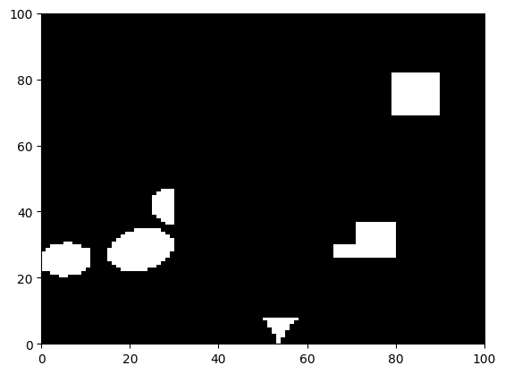
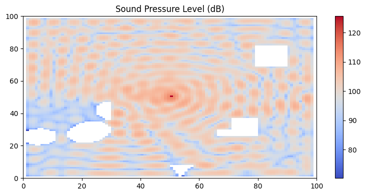

# Sound wave simulation

This project provides a ready-to-use **simulator** of  **acoustic wave propagation** in a field including sound **obstacles**, based on **cellular automata**. 
Lightweight and fast, it complements Alexander3's [implementation] and relies on the [work] of *T. Komatsuzaki et al.*.

## Installation

The current project is implemented in *python* 3.7 and requires the following dependencies:

* *click*: for creating a command line interface
* *joblib*: for CPU parallel computing 
* *scikit-image*: for generating random obstacles in the field 

```sh
pip install click joblib scikit-image
```
## Getting started

First, let's start by generating a map with random obstacles. We prepared a random shape generator in the module `utils`.

Note that the simulator works with any other binary matrix you provide.

```python
import matplotlib.pyplot as plt
from simulator import generate_random_map

# Generate random map of obstacle
# Note that you can use any other binary map you want
map_size = (100, 100)
random_seed = 1
obstacle_map = generate_random_map(map_size, random_seed=random_seed)

# Plot generated map
plt.pcolormesh(obstacle_map, cmap="gray")
```


Now, we run the simulator for 200 time steps and compute the resulting sound pressure level map.  

```python
from simulator import SoundSimulator

# Simulation
duration = 200
simulation = SoundSimulator(map_size=map_size, 
                            obstacle_map=obstacle_map, 
                            duration= duration)
simulation.run()
spl = simulation.spl(integration_interval=100)
```

Finally, we display the obtained pressure field:

```python
# Display the sound pressure level field
fig, ax= plt.subplots(nrows=1, ncols=1, figsize=(8,4), sharey=True)
spl_plt = ax.pcolormesh(spl, cmap="coolwarm")
plt.colorbar(spl_plt, ax=ax)
ax.set_title("Sound Pressure Level (dB)")
fig.tight_layout()
```


## How to use the CLI

* To run 10 random simulations lasting each 200 iterations and saving the results in the current directory, run the following line:

```sh
python -m src.simulate -n 10 -d 200 -p .
```

* The result of each simulation is stored separately in a file named `example_x.pickle`. 
One can load and visualize the results by running `src.load_n_viz`.

```sh
python -m src.load_n_viz
```
* For additional details about the arguments, a help page can be displayed:

```sh
python -m src.simulate --help
```


[implementation]: <https://github.com/Alexander3/wave-propagation>
[work]: <https://www.researchgate.net/publication/302225436_Modelling_of_Incident_Sound_Wave_Propagation_around_Sound_Barriers_Using_Cellular_Automata>

