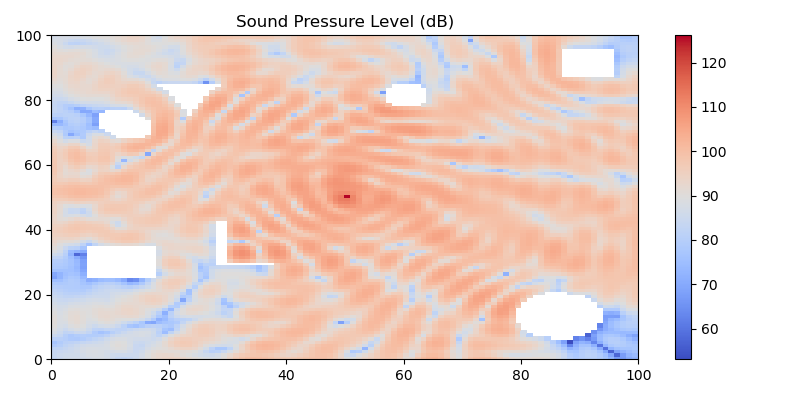

# Sound wave simulation

This project provides a ready-to-use **simulator** of  **acoustic wave propagation** in a field including sound **obstacles**. 
It complements Alexander3's [implementation] and relies on the [work] of *T. Komatsuzaki et al.*.

## Installation

The current project is implemented in *python* 3.7 and requires the following dependencies:

* ~click~: for creating a command line interface
* ~joblib~: for CPU parallel computing 
* ~tqdm~: for tracking the simulation loop through a nice progress bar
* ~scikit-image~: for generating random obstacles in the field 

#### Installation with Conda

```sh
conda install click joblib tqdm scikit-image
```

#### Installation with pip

```sh
pip install click joblib tqdm scikit-image
```
    

## How to use

* To run 10 random simulations lasting each 200 iterations and saving the results in the current directory, run the following line:

```sh
python simulate.py -n 10 -d 200 -p .
```

* The result of each simulation is stored separately in a file named `example_x.pickle`. 
One can load and visualize the results by running `load_n_viz.py`:




* For additional details about the arguments, a help page can be displayed:

```sh
python simulate.py --help
```


[implementation]: <https://github.com/Alexander3/wave-propagation>
[work]: <https://www.researchgate.net/publication/302225436_Modelling_of_Incident_Sound_Wave_Propagation_around_Sound_Barriers_Using_Cellular_Automata>

